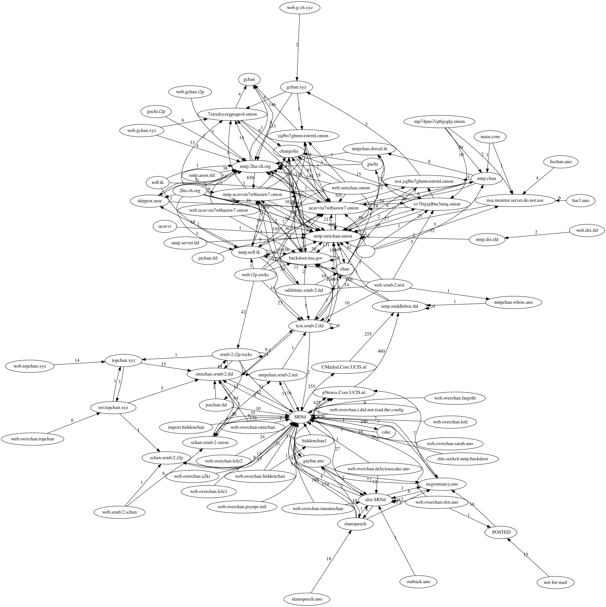

## Map the nntpchan network

That's a map of all the posts to the `overchan.test` board, by volume. It can do more than one group at a time too. Configure your server and groups in map.py and run it, it will dump all of its output to a file called "test." Pipe test into neato to create a graph as an SVG.

Some other maps

ctl

a mix of ctl and half of o.test

